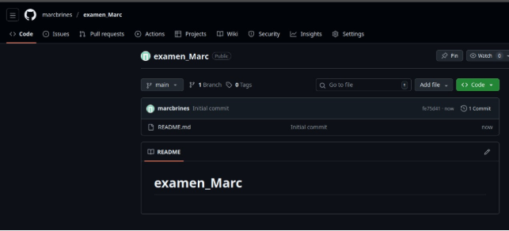
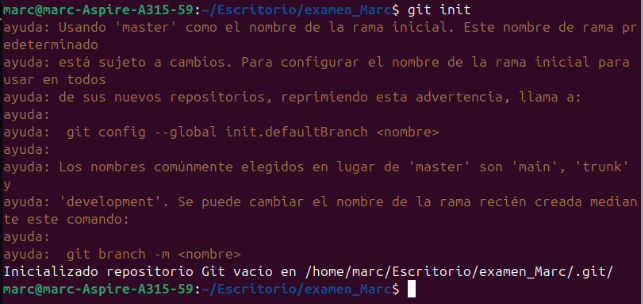
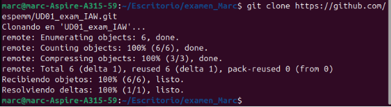
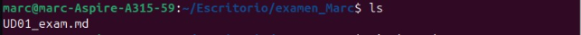
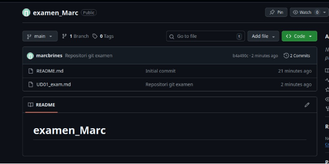
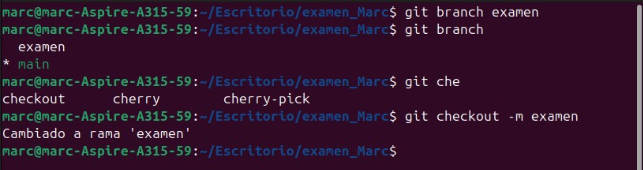
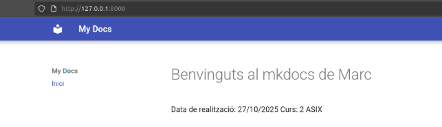

EXAMEN\_GITHUB\_MARC\_BRINES

Marc Brines Bañuls 2 ASIX IAW

Abans de començar ens dirigim al meu github (marcbrines), per a crear un repositori on anem a crear “examen\_Marc”.

*Fig 1: Creació del nou repositori.* Una vegada creat, anem a clonar el repositori de l’examen.

*Fig 2: Creació del repositori i inicialització a git.*

*Fig 3: Clonació del repositori de l’examen.*

*Fig 4: Comprovem que està el fitxer.*

*Fig 5: Comprovació del fitxer pujat al meu repositori.*

*Fig 7: Creació i cambi de rama “examen.”*

Marc Brines Bañuls 3 ASIX IAW

3

*Fig 8: Configurem la pàgina inicial ( sense enllaços. )*
Marc Brines Bañuls 2 ASIX IAW

4
